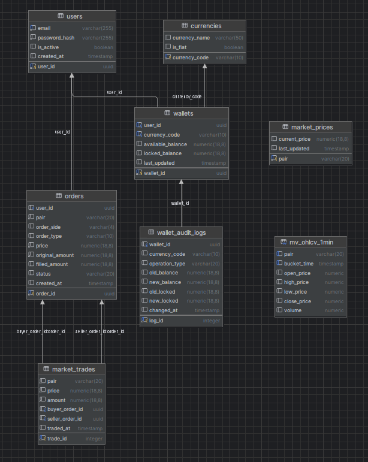

# 🚀 High-Performance Crypto Exchange Engine (PostgreSQL)

This project is a high-performance, **ACID-compliant Crypto Exchange Matching Engine** built entirely using **raw SQL (PL/pgSQL)** on PostgreSQL.

Unlike traditional backend architectures where business logic resides in the application layer (Node.js, Python, etc.), this engine executes critical financial operations directly within the **database layer**. This approach ensures maximum data integrity, transactional safety, and minimal latency.

---

## 🏗 Architecture & Database Schema

The system is designed with a normalized relational schema, enforcing strict **Referential Integrity**.

*(Entity-Relationship Diagram)*

---

## 🌟 Key Technical Features

This project demonstrates advanced database engineering concepts:

* **⚡ Event-Driven Matching Engine:** Utilizes `AFTER INSERT` triggers to automatically execute the matching algorithm (FIFO) whenever a new order is placed.
* **🔒 ACID Transactions & Concurrency:** Implements strict transaction controls to prevent **Double Spending** and **Race Conditions** in a high-concurrency environment.
* **🛡️ Immutable Audit Logging:** Every change in user balance is captured by triggers and recorded in the `wallet_audit_logs` table with "Before" and "After" snapshots.
* **📊 Real-Time Analytics:** Uses **Materialized Views** to calculate and cache OHLCV (Open, High, Low, Close, Volume) candlestick data for high-performance charting.
* **🔗 Data Integrity:** extensive use of Foreign Keys and Check Constraints ensures that no invalid states (e.g., negative balances, orphaned trades) can exist.

---

## 📂 Project Structure

The codebase is organized into modular SQL scripts:

├── 01_schema.sql      # Database definitions (Tables, Constraints, Views)
├── 02_logic.sql       # Stored Procedures (Business Logic) & Triggers
├── 03_seed.sql        # Initial test data (Users, Currencies, Balances)
├── 04_playground.sql  # Simulation scripts to test trading scenarios
└── eer-diagram.png     # Database visualization image

## 🛠  Core Functions
(API)The system exposes a clean PL/pgSQL API for external applications:

├── sp_place_order -- Validates balance, locks funds, creates a limit order, and triggers the matching engine.
├── sp_cancel_order -- Cancels an open order and instantly refunds the locked assets to the user's wallet.
├── sp_match_orders(Internal) -- The core matching algorithm. Scans the order book and executes trades based on price/time priority.
└── sp_log_wallet_changes(Trigger) -- Automatically logs wallet updates for compliance and auditing.

## 🚀 Installation & Usage
To run this project locally:

├── 1. Create a Database: Create a new PostgreSQL database.

├── 2. Execute Scripts in Order: Run the SQL files in your preferred editor (DataGrip, DBeaver, pgAdmin):
      01_schema.sql (Builds the structure)
      02_logic.sql (Loads the engine)
      03_seed.sql (Populates test data)

└── 3. Run Simulation: Use the 04_playground.sql file to simulate trades.

## 📊 EXAMPLE USAGE(SQL)

-- Alice places a 1 BTC Sell order for 95000$
SELECT sp_place_order(v_alice_id, 'BTC/USDT', 'SELL', 95000, 1.0);

-- Alex places a 1 BTC Buy order for 95500$. The system matches these two orders automatically even though the sell order is less than Alex's buy order.
SELECT sp_place_order(v_alex_id, 'BTC/USDT', 'BUY', 95500, 1.0);

## 👨‍💻 Developer Note
This project was built to showcase expertise in Database Engineering, PL/pgSQL, and Financial System Architecture. It highlights the power of moving critical business logic closer to the data.
